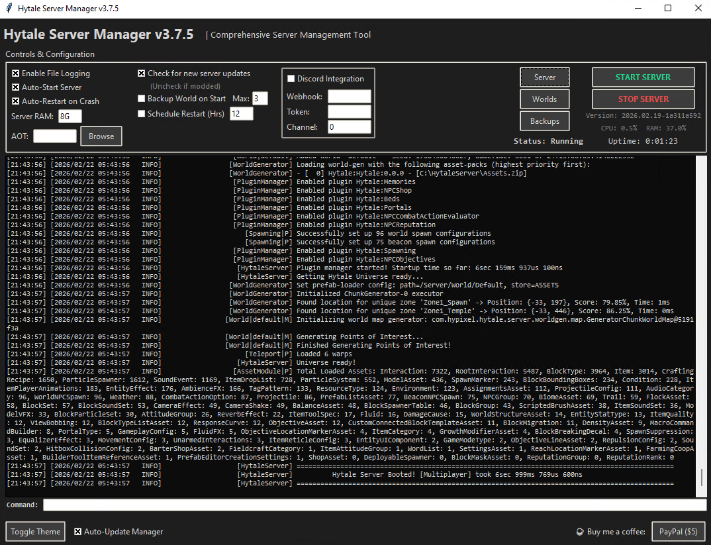

<div align="center">
  <h1>🎮 Hytale Server Manager</h1>

  <p>
    <b>A robust, Python-based automation script designed for managing Dedicated Hytale Servers with a focus on reliability, performance, and remote management.</b>
  </p>

  <p>
    
    
    
  </p>
</div>



---

## ✨ Key Features

* 🖥️ **Dual Interfaces:** Launch via the modern, user-friendly graphical interface (GUI), or utilize the headless console mode (`-nogui`) for streamlined server environments.
* 🔄 **Automated Updates:** Seamlessly checks the project's Git master branch via HTTP. When an update is detected, it automatically downloads and executes a safe installer script, minimizing downtime.
* 🛡️ **Crash Detection & Auto-Restart:** Continually monitors the server process and issues automatic restarts to maintain high uptime.
* ⏱️ **Scheduled Restarts:** Set specific intervals for automated, clean server reboots to prevent memory saturation and degradation over time.
* 💾 **Automated World Backups:** Archives the local server world directory into a `.zip` file prior to initialization. Prevents catastrophic data loss.
* 🚀 **Performance Optimization:** Automatically detects and enables the Java Ahead-Of-Time (`HytaleServer.aot`) cache, leading to dramatically faster startup times.
* 💬 **Discord Integration:** Features integrated Discord Webhooks to instantly alert your community on server status changes (Startup, Shutdown, Crashes). Includes a basic threaded bot for chat commands.
* 📡 **Background Polling:** In GUI mode, periodically scans for new official Hytale server versions every 30 minutes, downloading and replacing engine files as necessary.
* 🐧 **Linux Native Support:** Includes utilities for installing the manager as a native systemd service, and for enabling cross-distribution desktop auto-start.

---

## 🛠️ Technical Prerequisites

### Minimum Requirements

| Requirement | Details |
| :--- | :--- |
| **Operating System** | Windows, Linux, or macOS |
| **Memory** | At least `4G` allocated to the server heap (`8G` recommended) |
| **Java Environment** | **Java 25 is strictly required.** [Download from Adoptium](https://adoptium.net/temurin/releases/?version=25) |
| **Python** | Python 3.8 or higher + `psutil` module |

#### OS-Specific Python Setup

* **Windows:** [Download from Python.org](https://www.python.org/downloads/windows/). Ensure the installer box "Add Python to PATH" is checked. Run `pip install psutil`.
* **Linux:** Usually pre-installed. For the GUI to function, you may need to install the Tk UI library alongside `psutil` (`sudo apt install python3 python3-tk python3-psutil`).

---

## 🚀 Installation Guide

1. **Clone the Repository:** Download the repository source code, or grab the latest standalone `hsm.py` script.
2. **Locate Server Path:** Move the python script into the root directory where you intend to run (or are currently running) your Hytale dedicated server.
3. **Run Application:** Launch the program via your command line interface.

---

## 📖 Operational Guide

### Graphical Mode (Default)

Running the script parameter-free initializes the Graphical User Interface.

```bash
python hsm.py
```

* **Real-time Output:** View live stdout and stderr streams directly in the application pane.
* **Visual Configurations:** Toggle crucial behaviors like Backups, Discord Webhooks, and Auto-Restart intervals directly through application checkboxes.
* **Path Shortcuts:** Provides native file-explorer context buttons to rapidly open your Server Root, Worlds directory, and Backups archive.
* **Theming Options:** Supports dynamically un-toggling light and dark mode elements.

### Headless Console Mode

Targeting headless environments, the application can bypass the `tkinter` dependency completely. All required values are read directly from `hsm.conf` upon boot sequence.

```bash
python hsm.py -nogui
```

### Advanced Linux Utilities

The script provides CLI parameters to integrate seamlessly with various Linux distribution paradigms.

**Installing as a Background Service:**
Deploys `hsm.py` into a systemd service struct, enabling it to run entirely in the background and auto-boot alongside the machine.

```bash
sudo python3 hsm.py -install-service
sudo systemctl start hytale-manager
```

**Installing for Desktop Auto-Start:**
Creates a `.desktop` launch hook that executes upon the current user logging into a graphical desktop environment.

```bash
python3 hsm.py -enable-autostart
```

---

## ⚙️ Configuration Reference

Changes made to the server logic are primarily driven by the `hsm.conf` JSON flatfile auto-generated in the application root directory.

```json
{
  "manager_auto_update": true,
  "check_updates": true,
  "auto_start": false,
  "server_memory": "8G",
  "enable_backups": true,
  "max_backups": 3,
  "enable_auto_restart": true,
  "enable_schedule": false,
  "restart_interval": 12.0,
  "enable_discord": false,
  "discord_webhook": "YOUR_WEBHOOK_URL",
  "discord_token": "YOUR_BOT_TOKEN",
  "discord_channel_id": 1234567890
}
```

> **Note:** For the basic discord chatbot commands, verify your application's `Message Content Intent` is marked to `ON` within the Discord Developer portal.

---

## 🏷️ Versioning

**Current Version:** `3.7.1`
