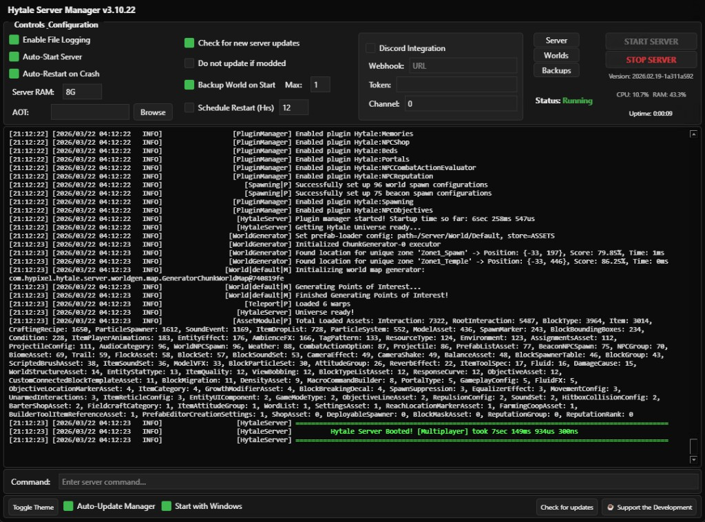

<div align="center">
  <h1>🎮 Hytale Server Manager</h1>

  <p>
    <b>A robust, Python-based automation script designed for managing Dedicated Hytale Servers with a focus on reliability, performance, and remote management.</b>
  </p>

  <p>
    
    
    
  </p>
</div>



*Screenshot: Hytale Server Manager v3.10.16 — Controls, live metrics (CPU/RAM/uptime), and console output.*

---

## ✨ Key Features

* 🖥️ **Dual Interfaces:** Launch via the modern, user-friendly graphical interface (GUI), or utilize the headless console mode (`-nogui`) for streamlined server environments.
* 📊 **Live Dashboard Metrics:** The GUI provides a live readout of current system CPU and RAM utilization.
* 🔄 **Automated Updates:** Seamlessly checks the project's Git master branch via HTTP. When an update is detected, it automatically downloads and executes a safe installer script, minimizing downtime.
* 🛡️ **Crash Detection & Auto-Restart:** Continually monitors the server process and issues automatic restarts to maintain high uptime.
* ⏱️ **Scheduled Restarts:** Set specific intervals for automated, clean server reboots to prevent memory saturation and degradation over time.
* 💾 **Automated World Backups:** Archives the local server world directory into a `.zip` file prior to initialization. Prevents catastrophic data loss.
* 🚀 **Performance Optimization:** Automatically detects and enables the Java Ahead-Of-Time (`HytaleServer.aot`) cache, leading to dramatically faster startup times.
* 🖥️ **Start with Windows:** On Windows, conveniently set the manager to launch automatically on system boot (with a 30s delay).
* 💬 **Discord Integration:** Features integrated Discord Webhooks to instantly alert your community on server status changes (Startup, Shutdown, Crashes). Includes a basic threaded bot for chat commands.
* 📡 **Background Polling:** In GUI mode, periodically scans for new official Hytale server versions every 30 minutes, downloading and replacing engine files as necessary.
* 🐧 **Linux Native Support:** Includes utilities for installing the manager as a native systemd service, and for enabling cross-distribution desktop auto-start.
* 📦 **Smart Pre-req Check:** If PySide6 or psutil is missing, a visible dialog offers to install them—even when launched with pythonw (no console).

---

## 🛠️ Technical Prerequisites

### Minimum Requirements

| Requirement | Details |
| :--- | :--- |
| **Operating System** | Windows, Linux (incl. Arch), macOS |
| **Memory** | At least `4G` allocated to the server heap (`8G` recommended) |
| **Java Environment** | **Java 25 or higher is strictly required.** [Download from Adoptium](https://adoptium.net/temurin/releases/?version=25) |
| **Python** | Python 3.8+ with `psutil` and `PySide6` |

#### OS-Specific Setup

| Platform | Install Dependencies | GUI | Notes |
|----------|----------------------|-----|-------|
| **Windows** | `pip install -r requirements.txt` | Yes | Add Python to PATH. Double-click `hsm.pyw` or use `pythonw hsm.pyw` for silent launch. |
| **Linux** (Ubuntu, Debian, etc.) | `pip install -r requirements.txt` | Yes | `sudo apt install python3 python3-pip` if needed. |
| **Arch Linux** | `pip install -r requirements.txt` or `pacman -S python-psutil pypi-pyside6` | Yes | PySide6: `pip install PySide6` or use AUR `python-pyside6`. |
| **macOS** | `pip install -r requirements.txt` | Yes | Use system Python or [python.org](https://www.python.org/downloads/macos/) build. Apple Silicon and Intel supported. |

---

## 🚀 Installation Guide

1. **Clone the Repository:** Download the repository source code, or grab the latest standalone `hsm.pyw` script.
2. **Locate Server Path:** Move the python script into the root directory where you intend to run (or are currently running) your Hytale dedicated server.
3. **Run Application:**
   - **Windows:** Double-click `hsm.pyw` (launches with `pythonw.exe`, no console). Or run `python hsm.pyw` in a terminal.
   - **Linux / Arch:** `python3 hsm.pyw` or `python hsm.pyw`
   - **macOS:** `python3 hsm.pyw` or `python hsm.pyw`

---

## 📖 Operational Guide

### Graphical Mode (Default)

Running the script initializes the Graphical User Interface.

```bash
python3 hsm.pyw
```

*(Note: On Windows, opening `hsm.pyw` with `pythonw.exe` hides the background console).*

* **Unified Flat Design:** A streamlined PySide6 Qt interface with a column-based layout that displays all server controls, metrics, and configurations at a glance—no tab switching required.
* **Real-time Output:** View live stdout and stderr streams directly in the expanded application console pane, optimized to prevent line wrapping for better readability.
* **Visual Configurations:** Toggle crucial behaviors like Backups, Discord Webhooks, and Auto-Restart intervals directly through application checkboxes.
* **Path Shortcuts:** Provides native file-explorer context buttons to rapidly open your Server Root, Worlds directory, and Backups archive.
* **Theming Options:** Supports dynamically un-toggling light and dark mode elements.

### Headless Console Mode

Targeting headless environments, the application can bypass the PySide6 GUI dependency completely. All required values are read directly from `hsm.conf` upon boot sequence.

```bash
python3 hsm.pyw -nogui
```

### Platform-Specific Utilities

**Linux & Arch Linux (systemd):**

```bash
# Install as a background service
sudo python3 hsm.pyw -install-service
sudo systemctl start hytale-manager

# Add to desktop autostart
python3 hsm.pyw -enable-autostart
```

**Windows:** Use the GUI "Start with Windows" checkbox to add to registry autostart.

**macOS:** CLI autostart is not supported. Add to **System Preferences → Users & Groups → Login Items** manually.

---

## ⚙️ Configuration Reference

Changes made to the server logic are primarily driven by the `hsm.conf` JSON flatfile auto-generated in the application root directory.

```json
{
  "manager_auto_update": true,
  "start_with_windows": false,
  "check_updates": true,
  "auto_start": false,
  "server_memory": "8G",
  "enable_backups": true,
  "max_backups": 3,
  "enable_auto_restart": true,
  "enable_schedule": false,
  "restart_interval": 12.0,
  "enable_discord": false,
  "discord_webhook": "YOUR_WEBHOOK_URL",
  "discord_token": "YOUR_BOT_TOKEN",
  "discord_channel_id": 1234567890
}
```

> **Note:** For the basic discord chatbot commands, verify your application's `Message Content Intent` is marked to `ON` within the Discord Developer portal.

---

## 🏷️ Versioning

**Current Version:** `3.10.20`

See [CHANGELOG.md](CHANGELOG.md) for full version history.
